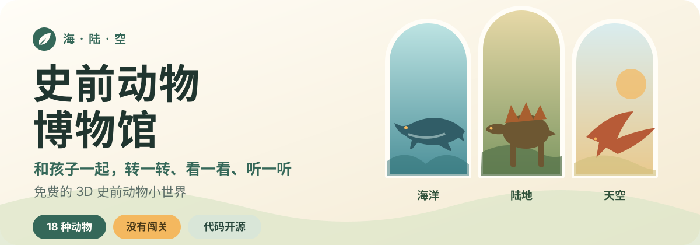
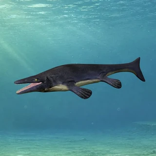

<p align="center">
  
</p>

<p align="center">
  <strong>给好奇的孩子，也给愿意坐在一旁一起看的大人。</strong><br>
  用简体中文或英文观察史前动物展品，听一段短旁白，再从家长资料继续聊下去。
</p>

<p align="center">
  <strong><a href="https://leon-made-this.work/museum/zh-CN/">官方网站 →</a></strong>
  · <a href="https://leon-made-this.work/">Leon做了个</a>
  · <a href="README.md">English</a>
  · <strong>简体中文</strong>
</p>

<p align="center">免费访问 · 无需注册 · 没有广告 · 没有访问统计脚本</p>

| 海 · 沧龙 | 陆 · 剑龙 | 空 · 古神翼龙 |
| :---: | :---: | :---: |
|  |  |  |

## 安静地看一只史前动物

女儿三岁时，看到电视里的恐龙会有点害怕。那些故事常常围绕追逐、对抗和“打败恐龙”，很少留出时间，让孩子只看看动物本身。

我想给她一个没有输赢，也没有惊吓画面等在下一秒的地方。孩子可以选一只动物，换个角度观察，再听一段简短介绍；大人可以补充一句、问一个问题，也可以什么都不说，只陪着看。

这里不追求让孩子一直留在屏幕前。一次发现一个有趣的细节，就已经足够。

## 一起逛逛

- **换个角度观察**：用手指或鼠标拖动模型，双指或滚轮可以放大、缩小。
- **想听时再听**：普通话和英文短旁白都不会自动播放。
- **顺着问题聊下去**：家长资料包含生活时期、化石发现地区、体型、食性、分类和参考来源。
- **舒服地使用**：响应式排版适配手机、平板和桌面尺寸，也能用键盘操作，并尊重系统的“减少动态效果”设置。

第一次打开时，博物馆会跟随设备语言。你可以随时切换简体中文和英文；选择会被记住，也可以直接分享对应语言的链接。

博物馆主要为 2～6 岁孩子设计，建议第一次探索时有大人陪在身边。年龄不是门槛；如果某个画面或声音让孩子不舒服，换一只动物或直接关掉就好。

## 来自海、陆、空的史前动物展品

<details>
<summary><strong>查看完整馆藏</strong></summary>

- **陆地**：剑龙、肿头龙、霸王龙、三角龙、迷惑龙、巨盗龙、长毛猛犸象、慈母龙、胄甲龙、双冠龙、棘龙、水龙兽、重爪龙、食肉牛龙。
- **天空**：无齿翼龙、喙嘴翼龙、古神翼龙、巨脉蜻蜓、始祖鸟。
- **海洋**：鱼龙类、蛇颈龙类、巨齿鲨、沧龙、奇虾。

</details>

“鱼龙类”和“蛇颈龙类”分别代表较大的动物类群，并不是某一个确定物种。化石没有留下全部答案，因此模型的颜色、软组织和部分动作属于基于现有证据的艺术复原，并不是能够完全确定的原貌。

## 安心地打开，也安心地关掉

- 应用没有登录和用户档案，也不会索取姓名或联系方式。“比一比”会让家长自愿选择男孩或女孩并填写大概身高，只用于当前页面里的 3D 人物比例与视角；不会写入网址、上传、进入分析数据，关闭页面后即消失。
- 应用内没有广告或访问统计脚本，也不设置会员、知识解锁或付费门槛。
- 逛博物馆时不会调用 AI、广告或分析服务；模型、图片和旁白都是预先准备好的静态内容。
- 没有自动播放，也不会催着孩子“逛完整座博物馆”。

## 在本地运行与参与

### 本地运行

需要 Node.js 20.19 或更新版本。

```sh
npm ci
npm run dev
```

<details>
<summary><strong>运行项目检查</strong></summary>

```sh
npm run lint
npm run typecheck
npm test -- --run
npm run build
npm run test:e2e
```

</details>

### 参与贡献

如果想提议一种新的史前动物，请先阅读[动物包编写指南](ANIMAL_AUTHORING_GUIDE.md)。提交代码、内容或素材前，请阅读[贡献指南](CONTRIBUTING.md)。

## 许可与素材来源

这个仓库包含几层边界清晰的许可：

- 软件代码采用 [GNU AGPL-3.0-only](LICENSE)。
- 原创博物馆文案、旁白、展厅背景和类似内容采用 [CC BY-NC-SA 4.0](LICENSES/CC-BY-NC-SA-4.0.txt)。
- 第三方库、字体、3D 模型和混合素材继续遵守各自记录的许可。
- “Leon做了个 / Leon Made This”、项目名称、标志及用于识别官方来源的品牌元素仅保留防止冒充官方所需的权利；在适用许可范围内，改名和替换品牌后的 Fork 仍然受到欢迎。

许可边界以及已记录的署名、来源和修改信息见[许可说明](LICENSING.md)、[品牌政策](BRAND_POLICY.md)、[贡献指南](CONTRIBUTING.md)与[第三方素材说明](THIRD_PARTY_NOTICES.md)。

<br><br>

<p align="center">
  <a href="https://github.com/s010s/prehistoric-animal-museum/stargazers">
    
  </a>
  &nbsp;
  <a href="https://atomgit.com/leonleung/prehistoric-animal-museum">
    
  </a>
</p>

<p align="center">
  <sub>
    <a href="https://github.com/s010s/prehistoric-animal-museum"><strong>GitHub</strong></a> 是项目主仓与开发协作入口，Issue 和 Pull Request 请在 GitHub 提交。<br>
    <a href="https://atomgit.com/leonleung/prehistoric-animal-museum"><strong>AtomGit</strong></a> 是面向中国大陆访问者的官方同步镜像。
  </sub>
</p>
